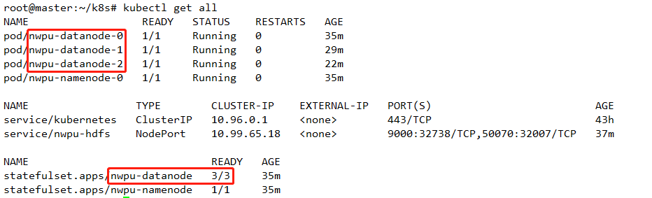
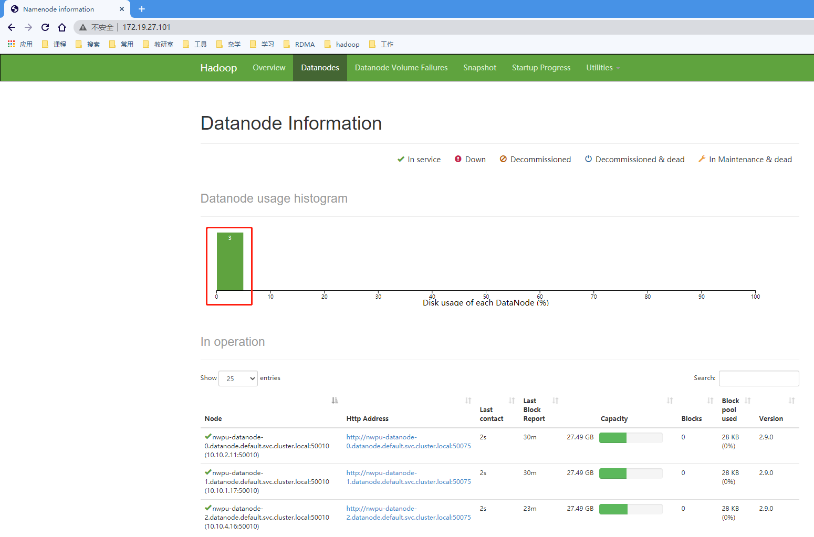
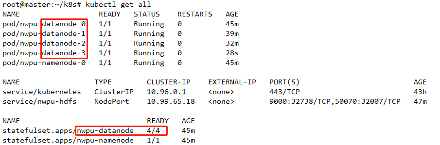
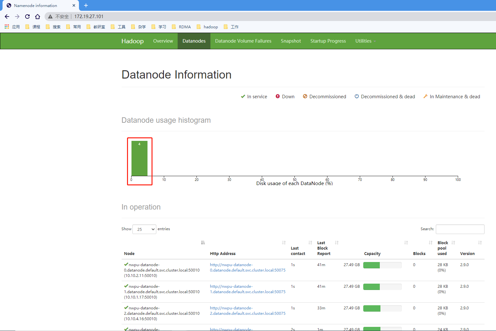

# Deploy the HDFS
```shell
kubectl apply -f deploy/
```

# Visit the web of NameNode
http://k8s-master-ip:32007/

# Scale manual
```shell
kubectl scale sts nwpu-datanode --replicas=4
```

# The change of HDFS cluster
befor scale : 3 pods and 3 DataNodes


after scale : 4 pods and 4 DataNodes


